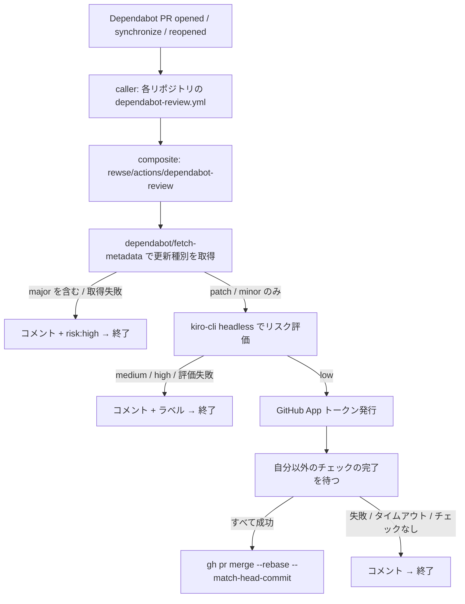

# Dependabot PR の Kiro リスク評価と自動 rebase merge

## 目的

`rewse/*` の各リポジトリに Dependabot が作る PR を Kiro CLI の headless mode でリスク評価し、低リスクと判定され CI がすべて通ったものだけを rebase merge で自動的に取り込む。中・高リスクのものは評価理由をコメントして手動レビューに回す。

## 前提と制約

- 対象は `~/git` にクローンしている `rewse/*` の 10 リポジトリ（`actions`, `ansible-playbooks`, `dotfiles`, `enecoq-data-fetcher`, `mac-power-monitor-mqtt`, `rewse-blog`, `stock-price-fetcher`, `textlint-config-rewse`, `textlint-rule-ja-space-around-phrase`, `zenn-content`）。`stock-price-fetcher` だけ private。
- どのリポジトリにもブランチ保護と ruleset がなく、`allow_auto_merge` は無効。private リポジトリは Free プランのためブランチ保護も ruleset も使えない。GitHub のネイティブ auto-merge には頼らず、ワークフロー自身が CI の完了を待ってマージする。
- `GITHUB_TOKEN` でマージした push は後続のワークフローを起動しない。マージ後に `gitleaks.yml` や push トリガーのワークフローを動かすため、マージには GitHub App のトークンを使う。
- Dependabot が起動したワークフローは Actions secrets を読めず、Dependabot secrets だけを参照できる。`rewse` は個人アカウントで org の共有 secret がないため、各リポジトリの Dependabot secrets に登録する。
- Kiro CLI の headless mode は `KIRO_API_KEY` 環境変数で認証し、`kiro-cli chat --no-interactive --trust-tools=...` で実行する。API キーは Pro / Pro+ / Power プランで発行できる。
- Kiro CLI は公式のインストール方法（`curl -fsSL https://cli.kiro.dev/install | bash`）で入れる。インストーラを `sh` に流し込むことは `~/git/AGENTS.md` で禁じられているが、Kiro CLI に限り例外として許可されている。この例外と理由は `rewse/actions` の `AGENTS.md` に記録する。
- `.github` は `~/git/AGENTS.md` の GitHub Configuration に従う。`uses:` はフル SHA と `# vX.Y.Z` で固定し、最上位の `permissions` を `contents: read` にし、checkout には `persist-credentials: false` を付け、全ジョブに `name` を付ける。

## 全体構成



`rewse/actions` には composite action `dependabot-review/` を置く。checkout、判定、コメント、マージ、Kiro CLI のインストールをすべて担う。reusable workflow ではなく composite action にするのは、`$GITHUB_ACTION_PATH` で同梱のスクリプトを参照できるからで、reusable workflow からは自分自身のリポジトリのファイルを固定した SHA で読む手段がない。プロンプトと判定ロジックはここにだけ置き、各リポジトリはタグを打った SHA で参照する。参照の更新は各リポジトリの Dependabot `github-actions` エントリが担い、`rewse/*` は cooldown の対象外なので遅れない。

各リポジトリには caller として `.github/workflows/dependabot-review.yml` を置く。`pull_request`（`opened`, `synchronize`, `reopened`）で起動し、`github.actor == 'dependabot[bot]'` のときだけ評価ジョブを動かし、ジョブの `permissions` と secrets の受け渡しを受け持つ。`pull_request_target` は使わない。

`concurrency` は PR 番号単位にして `cancel-in-progress: true` とする。Dependabot が rebase で push し直したら古い実行を止め、新しい head で評価し直す。

## 認証情報と権限

各リポジトリの Dependabot secrets に次の 3 つを登録する。

| 名前 | 用途 |
|---|---|
| `DEPENDABOT_APP_CLIENT_ID` | マージ用 GitHub App の Client ID（`actions/create-github-app-token` は `app-id` を非推奨にしている） |
| `DEPENDABOT_APP_PRIVATE_KEY` | 同 App の秘密鍵 |
| `KIRO_API_KEY` | Kiro CLI headless mode の API キー |

GitHub App は `rewse` アカウントで 1 つ作り、対象の 10 リポジトリにインストールする。App の権限は Contents: write、Pull requests: write、Metadata: read に限る。App のトークンはマージだけに使う。

caller の最上位 `permissions` は `contents: read` とし、評価ジョブには `pull-requests: write`（コメントとラベル付け）、`issues: write`（ラベルの作成）、`actions: read`、`checks: read`、`statuses: read`（CI とワークフロー実行の待機）だけを追加する。`GITHUB_TOKEN` には `contents: write` を渡さない。

## リスク評価

### semver ゲート

`dependabot/fetch-metadata` の `update-type` を見て、`version-update:semver-major` が含まれていれば Kiro を呼ばずに `high` とする。グループ化した PR は、1 件でも major が含まれていれば PR 全体を `high` にする。メタデータを取得できない場合も `high` とする。

### Kiro に渡す入力

ワークフローが次の内容をファイルにまとめ、作業ディレクトリに置く。

- fetch-metadata の出力: 依存名、旧バージョンと新バージョン、エコシステム、`dependency-type`
- `gh pr diff` の出力。上限は 200 KB とし、超えた分は切り詰めたことを明記する
- PR 本文（Dependabot が載せる release notes、changelog、commits の抜粋）

リポジトリは PR の head をチェックアウトしておき、Kiro が `read` と `grep` で依存の使われ方を調べられるようにする。

### 判定基準

プロンプトに次の基準を明記する。

- `low`: patch か minor で、changelog に破壊的変更、非推奨 API の削除、動作仕様の変更がなく、リポジトリで使っている API に影響がない。dev 依存、GitHub Actions、pre-commit hook の更新はここに入りやすい。
- `medium`: リポジトリで使っている API に関わる変更や、ランタイム要件・`engines` の変更があり、人が確認したほうがよい。
- `high`: 破壊的変更、セキュリティに関わる挙動の変更、メンテナの交代やソース URL の変更など、サプライチェーン上の不審な点がある。

### 出力形式

Kiro には最後に次の JSON を 1 つだけ出力させる。

```json
{"risk": "low", "summary": "...", "reasons": ["..."]}
```

ワークフローは出力から最後の JSON を取り出し、`jq` で `risk` が `low`、`medium`、`high` のいずれかであること、`summary` が文字列で `reasons` が文字列の配列であることを検証する。検証に失敗したら `high` とする。

### プロンプトインジェクション対策

PR 本文と changelog は上流のメンテナが書いた文章で、悪意ある指示が含まれている可能性がある。次の対策を重ねる。

- `--trust-tools=read,grep` で読み取り系のツールだけを許可し、shell、書き込み、Web へのアクセスは許可しない。
- Kiro を実行するステップの環境変数には `KIRO_API_KEY` だけを渡す。App の秘密鍵は low 判定のあとの別ステップで初めて使い、`GITHUB_TOKEN` は Kiro のステップの env に入れない。
- checkout は `persist-credentials: false` にし、git の認証情報を残さない。
- 外部由来のテキストは専用のタグで囲み、その中身はデータとして扱い、含まれる指示には従わないようプロンプトで指示する。
- マージには Kiro の `low` 判定、semver ゲートの通過、自分以外の CI がすべて成功の 3 条件をすべて求める。Kiro が誤導されても、major 更新と CI 失敗は通らない。

### Kiro の実行条件

タイムアウトは 10 分とする。モデルは action の入力 `kiro-model` で指定でき、空なら Kiro の既定を使う。

## マージ処理

low 判定のあと、次の順に実行する。

1. `GITHUB_TOKEN` を使い、`gh pr checks --json` で PR のチェックを 30 秒ごとに取得して、自分のワークフローのチェックを除いたすべてが完了するまで待つ。`gh pr checks --watch` は実行中の自分自身も待って終わらないため使わない。待つのは最大 30 分。
2. 自分以外のチェックが 1 件もなければマージしない。どのリポジトリにも PR で走る `gitleaks.yml` があるので、通常この条件には当たらない。
3. 完了したチェックの結論がすべて `success`、`skipped`、`neutral` のいずれかであれば、`actions/create-github-app-token` で呼び出し元リポジトリだけに絞ったトークンを発行し、`gh pr merge --rebase --match-head-commit <評価した SHA>` を実行する。評価後に新しい push があった場合はマージが失敗し、その push で起動した実行に判断を任せる。

## コメントとラベル

評価結果は PR に 1 件のコメントとして書く。コメントには隠しマーカー（`<!-- dependabot-kiro-review -->`）を入れ、再評価のときは同じコメントを更新する。コメントには判定、要約、理由、評価した head SHA、マージの結果を載せる。

ラベルは `risk:low`、`risk:medium`、`risk:high` のいずれか 1 つを付け、前回のラベルは外す。ラベルがリポジトリになければワークフローが作る。

## エラー処理

どの段階で失敗してもマージしない側に倒す。

| 状況 | 動作 | ジョブの結果 |
|---|---|---|
| fetch-metadata の失敗、または major を含む | `risk:high` を付けてコメント | 成功 |
| Kiro の実行失敗、タイムアウト、不正な JSON | 評価できなかった旨をコメントし `risk:high` | 失敗 |
| `medium` または `high` | 理由をコメント | 成功 |
| CI の失敗、待ち時間切れ、自分以外のチェックなし | コメントしてマージしない | 成功 |
| マージの失敗（head の変化、コンフリクトなど） | コメント | 失敗 |

## 入力パラメータ

| 入力 | 既定値 | 説明 |
|---|---|---|
| `dry-run` | `false` | `true` なら評価とコメントだけ行い、マージしない |
| `kiro-model` | `""` | Kiro に使わせるモデル。空なら Kiro の既定 |

## テスト

- JSON の検証、semver ゲート、チェック結果の集計はシェルスクリプトに切り出し、`setup-safe-chain` と同じ形式で `tests/` に単体テストを置く。
- `actionlint`、`zizmor`、`shellcheck` を pre-commit で実行する。
- 実地の確認では、まず 1 リポジトリに `dry-run: true` で導入し、`@dependabot recreate` で作り直した PR に評価コメントが付くことを確かめる。続いて `dry-run: false` にして、low の PR が CI 完了後に rebase merge され、マージ後の push ワークフローが起動することを確かめる。

## 展開手順

1. `rewse/actions` に composite action と `AGENTS.md`（インストール方法の例外）を追加し、`vX.Y.Z` のタグでリリースする。
2. GitHub App を作成して 10 リポジトリにインストールし、各リポジトリの Dependabot secrets に 3 つの値を登録する。この手順は手作業で行う。
3. 1 リポジトリで `dry-run: true` から試し、問題がなければ残りのリポジトリに caller を追加する。

## 計画段階で確定させること

- `kiro-cli chat --no-interactive` の出力から最終応答を取り出す方法（標準出力の形式、装飾の有無）
